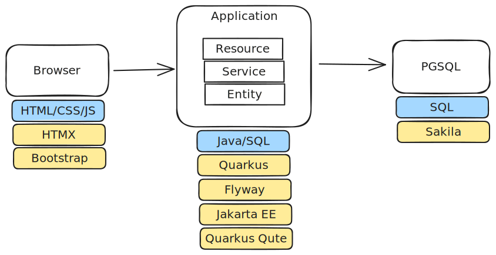
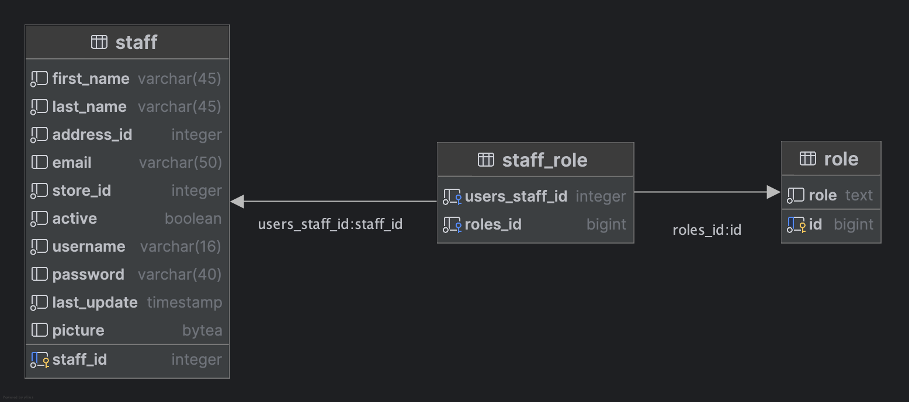
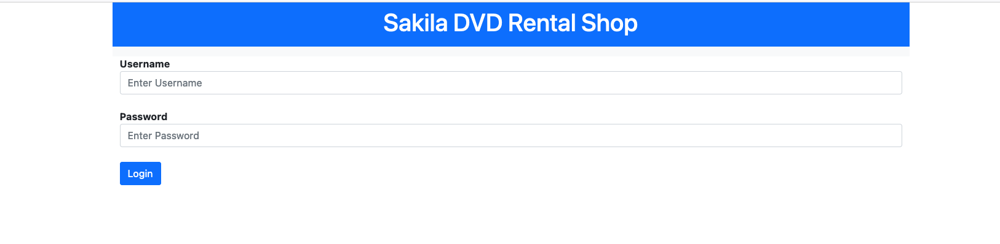
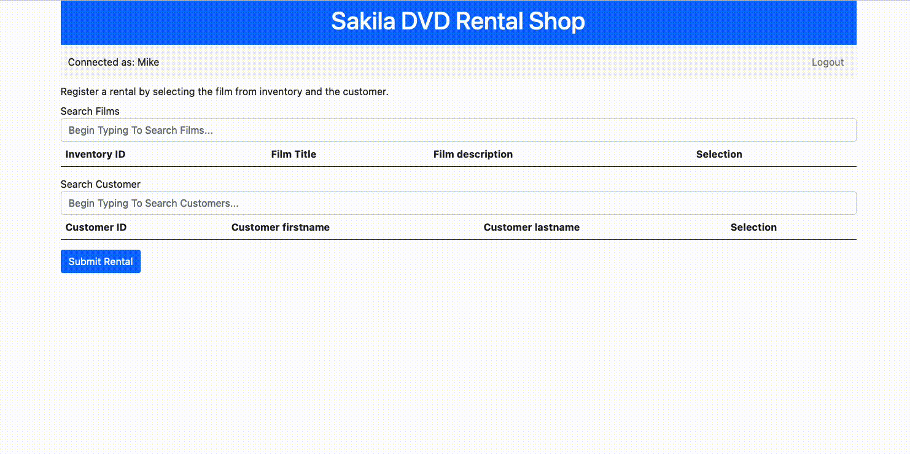

[](https://classroom.github.com/a/4YfzsM5K)
# Quarkus with Sakila

If you want to learn more about Quarkus, please visit its website: https://quarkus.io/ .

If you want to learn more about Sakila, please visit: https://www.jooq.org/sakila

## Dev environment

Make sure to have a Quarkus tooling in the IDE: https://quarkus.io/guides/ide-tooling

> **_NOTE:_**  If you are using IntelliJ IDEA Ultimate, do not install the IntelliJ Quarkus Tools plugin, but use the built-in Quarkus features available in IntelliJ IDEA Ultimate instead, as the former can cause troubles according to our tests.

You can run your application in dev mode that enables live coding using:

```shell script
./mvnw compile quarkus:dev
```

Alternatively use the IDE integration to execute the dev mode from within the IDE by following the documentation of the tooling installed.

> **_NOTE:_**  Quarkus now ships with a Dev UI, which is available in dev mode only at http://localhost:8080/q/dev/.

The Postgresql database managed by Quarkus Dev Services is available at `localhost:55432, username=postgres, password=postgres, db=postgres`.
The database is only up and running while running Quarkus dev mode.

## Directives
Not respecting the following directives will lead to penalties during grading:
- All instructions given in Javadoc must be followed.
- Existing files located in `src/test` must not be modified.
- The file `pom.xml` must not be modified.

The above rules apply for changes commited and pushed to the repository. Grading will only be made on content  published to the repository on `main` branch.

The `REPORT.md` file must be completed.

## Architecture
The following diagram depicts the main components, showing the placement of each technology and tool.


## Exercise 1 - Transaction, Renting a DVD
* Implementation service: `RentalService`
* Validation tests: `RentalServiceTest.testRental`

In this exercise, the objective is to implement a service that allows staff to register the rental of DVDs (i.e., inventory items) by customers. The implementation must ensure that an inventory item is rented out only once, thereby guaranteeing that concurrent attempts to rent the same available inventory item result in only one active rental.

To do so, identify the following:
* Determine what defines an active rental in the Sakila database in terms of the table's content.
* Identify the required combinations of SQL queries to register the rental of an inventory item that is still available.

> **_HINT:_** you may need to read [this article](https://www.postgresql.org/docs/current/sql-lock.html) or [this one](https://www.postgresql.org/docs/current/sql-set-transaction.html) to find a proper solution to manage the concurrency.

> **_NOTE:_**  Do not use an application side only concurrency control such as [@Lock](https://quarkus.io/guides/cdi-reference#container-managed-concurrency) or Java `synchronized`


Once you have a clear understanding of both aspects, you can begin the implementation or experiment with queries directly on the database.

**Report** 
* Describe an alternative strategy that could achieve a similar result to the one implemented.
* Explain why managing the concurrency using [@Lock](https://quarkus.io/guides/cdi-reference#container-managed-concurrency) or Java `synchronized` is not a solution.

## Exercise 2 - Implement search for films and customers
* Implementation: `RentalService`
* Validation tests: `RentalServiceTest.testSearch*`

Implement the search service for films in inventories.
One should be able to perform a full text search on the following fields:
- title
- description
- inventory_id

Implement the search service for customers.
One should be able to perform a full text search on the following fields:
- customer_id
- first_name
- last_name

The search functionality focuses solely on whole-word searches, without the need for partial, suffix, or prefix search capabilities.

## Exercise 3 - Implement authentication for staff
* Implementation resource: `HelloResource`
* Validation tests: `GreetingResourceTest`

In this exercise, the existing `staff` table will be utilized to facilitate staff authentication, utilizing the username and password fields already present in the `staff` table. For this implementation, only HTML is required on the frontend; the use of CSS and, especially, JavaScript is prohibited.

### Add the quarkus-security-jpa dependency
```
./mvnw quarkus:add-extension -Dextensions="io.quarkus:quarkus-security-jpa"
```
https://quarkus.io/extensions/io.quarkus/quarkus-security-jpa

Enable Quarkus form authentication. See: https://quarkus.io/guides/security-authentication-mechanisms#form-auth

###  Entities and Database migration
Quarkus Security JPA requires that the entity utilized for authentication includes a role field. Thus, it is required to extend the `Staff` entity to accommodate a role field.

* Implement a `Role` entity 
* Enhance the `Staff` entity by adding annotations from Quarkus Security JPA.
* Add a `roles` field to the `Staff` entity.
* Implement database migrations to match the changes in entities, in the file `src/main/resources/schema/V3.0.0__authentication.sql`.



See: https://quarkus.io/guides/security-jpa

The password of the staff is hashed with the SHA1 hashing algorithm, see [this article](https://quarkus.io/guides/security-jpa#password-storage-and-hashing) to see how to set a custom password provider.

Note: While the roles can be empty, they must be present. An alternative to having a separate table would be to add a column in the `staff` table.

Note: The Quarkus Security JPA annotation `@UserDefinition` appears to necessitate that the associated entity is named precisely after the class name. Consequently, `@Entity(name = "staff")` may not work and should be replaced by an alternative.

**Report** Explain why the password storage in Sakila `Staff` table is insecure and propose a solution (without implementing it) for a more secure password storage. 

###  Implement the login.html page

The `error.html` page is already implemented and contains a link to  `login.html`.

The `login.html` page must be implemented in plain HTML. It uses the defaults provided by Quarkus security to submit the authentication to the application.
See: https://quarkus.io/guides/security-authentication-mechanisms#quarkus-vertx-http-config-group-form-auth-config_configuration

The plain HTML file should be added in `src/main/resources/META-INF.resources` and will be exposed by the Quarkus application at the root path.

### Implement a protected endpoint
Extend `HelloResource` to include a protected endpoint that is accessible only to authenticated users. 
This endpoint should return a personalized greeting in the format: `Hello <authenticatedUsername>!`

See: https://quarkus.io/guides/security-authorize-web-endpoints-reference#standard-security-annotations

URL: http://localhost:8080/hello/me

### Manual test authentication
1. Navigate to: http://localhost:8080/login.html
2. Login as Mike:12345
3. Navigate to: http://localhost:8080/hello/me


Validate the implementation by running the tests contained in `GreetingResourceTest`.

**Report** Describe the flow of HTTP requests of the above test case and provide explanations for the following:
* What is sent at step 1 to authenticate to the application and how it is transmitted.
* What is the content of the response at step 2 that his specific to the authentication flow.
* What is sent at step 3 to authenticate the user to the application and how it is transmitted.

Explain why the above test authentication flow is considered insecure, if it was used in a productive environment as is, and what is required to make it secure. 

## Exercise 4 - Expose the rental service through an API restricted to staff
* Implementation resource: `RentalResource.registerRental`
* Validation tests: `RentalResourceTest`

In `RentalResource`, implement the API endpoint that processes a request from an authenticated staff member, utilizing the `RentalService.rentFilm` method.

To manually interact with this endpoint, you have two options: implement a plain HTML page to submit the request or use an API development tool (e.g. [Postman](https://www.postman.com/), [insomnia](https://github.com/Kong/insomnia)). In the later case, you will need to inject the cookie containing the necessary credentials in your request to authenticate it; you can either inject it as a request headers named `Cookie` or directly as a request cookie (you can find the
quarkus-credential cookie value using your browser webtools under Network -> Headers -> Cookies when accessing http://localhost:8080/hello/me while authenticated).

Alternatively, and as a last resort, you can temporarily disable authentication while progressing with the development and testing.


For this exercise, when returning content, utilize the provided `RentalResource.simple` template as follows:
```
return simple.data("content", "actualcontent");
```

## Exercise 5 - Implement a frontend for rentals
By building upon the previous exercises, complete the frontend templates and backend to fulfills the following user stories:
* As a staff member, I can authenticate to the platform with my username and password.
* As a staff member, I can search for films in inventories and search for customers, so that I can register a rental.

The design of this API and frontend will adhere to the [hypermedia pattern](https://htmx.org/essays/hypermedia-apis-vs-data-apis/). 

With the hypermedia API pattern, the server application returns HTML instead of data (i.e. JSON). On the server side, hypermedia content will be generated using [Quarkus Qute](https://quarkus.io/guides/qute). On the client side (i.e., the frontend), the [htmx](https://htmx.org/) library will be used to interact with the API, and [Bootstrap](https://getbootstrap.com/) will be used for CSS styling.

The search for films in inventory and customer are implemented using the following example as basis: https://htmx.org/examples/active-search/

### Login page
As depicted below, the login page must be enhanced with CSS styling.


### Rental page
As depicted below, the rental page must contain the tow search fields and allow the selection of item and customer for rental submission.
The following htmx features were used on this page: hx-post, hx-trigger (events modifiers from and target), hx-target, hx-indicator, hx-swap, hx-include, hx-get.
A few different Qute templates were used to generate the content of the page.



## Exercise 6 - (Bonus) Implement a logout
* Implementation resource: `LogoutResource`

The Quarkus form authentication does not provide a built-in logout. 
Implement a logout feature from the server side in the mentioned resource class, so that the user is not authenticated anymore and is redirected to login page.

## References

Qute:
* https://quarkus.io/guides/qute
* https://quarkus.io/guides/qute-reference

Bootstrap 5:
* https://getbootstrap.com/docs/5.0/getting-started/introduction/#css

