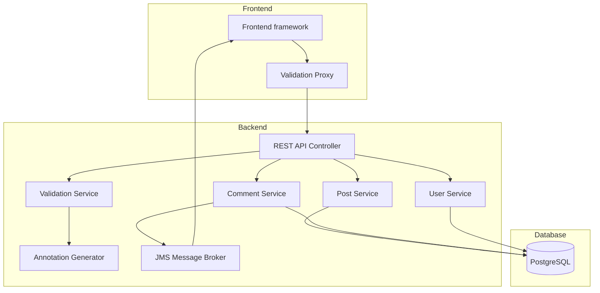
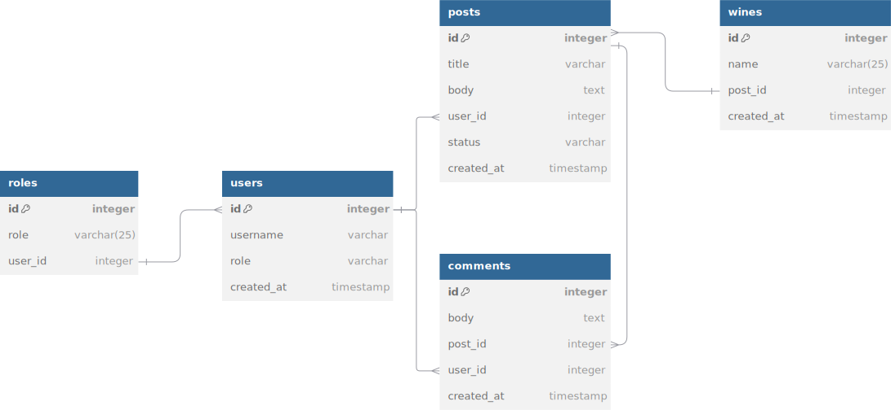

# Initial Report: Vineward - A Role-Based Wine Discussion Platform

## Purpose and Business Domain Summary

Vineward will serve as a specialized platform for wine enthusiasts and professionals to share insights, reviews, and discussions about wines. The application implements a sophisticated role-based validation system using code generation technologies to manage user permissions and content validation. This approach ensures that different user roles (such as sommeliers, admin and enthusiasts) have appropriate access levels and validation rules when interacting with the platform.

## Technology Stack and Innovation

The application will leverage several new technologies to implement its features:

1. JavaPoet: This will be our primary technology focus, serving as the cornerstone for generating Java source files at compile time. JavaPoet provides a fluent API for generating Java source files, making it ideal for implementing our custom validation system. We will use it to generate role-specific validation code based on annotations, creating type-safe permission checks and validation logic. Its powerful API will allow us to generate complex code structures while maintaining readability and maintainability of the generated code.
2. Mapstruct: For efficient mapping between domain models and DTOs, reducing boilerplate code and maintaining type safety.
3. Mockito: To create comprehensive test coverage, particularly for the validation and permission logic.
4. Lombok: To reduce boilerplate code in domain models and improve code readability.
5. Spring (Core): As the foundation framework, particularly utilizing its annotation processing capabilities.

The innovative aspect lies in creating a custom annotation-based validation system that generates role-specific validation code at compile time, primarily leveraging JavaPoet's capabilities. This system will automatically generate the necessary validation code based on role annotations, ensuring type safety and reducing runtime overhead. The combination of JavaPoet with other technologies creates a robust and maintainable permission system that catches potential permission violations at compile time rather than runtime.

## Architecture Diagram

## Data Model

## Implementation Strategy

The system will use a custom annotation processor to generate validation code at compile time. This approach offers several advantages:

1. Performance optimization by moving validation logic to compile time
2. Type-safe role-based permission checking
3. Reduced runtime overhead for permission validation
4. Clear separation of concerns between business logic and permission management

The validation system will be implemented through custom annotations such as `@RoleValidated` and `@RequiresRole`, which will trigger code generation for permission checking. This generated code will be integrated with Spring's security framework to provide seamless authorization.

The application will utilize JMS for asynchronous operations such as notification dispatch when new content is posted and for updating user activity metrics. This ensures the system remains responsive while handling background tasks effectively.
Through this implementation, we create a robust platform that maintains high performance while ensuring proper access control and content validation, all while leveraging modern Java technologies to reduce boilerplate code and improve maintainability.

## Personas and Permissions

### Geneva (Genevois)
**Wines concerned:** Gamay, Chasselas, Pinot Noir, Sauvignon Blanc, Mondeuse.

### Ticino (Tessinois)
**Wines concerned:** Merlot, Chardonnay, Sauvignon Blanc, Gamaret, Bondola.

### Three Lakes (Neuchâtelois)
**Wines concerned:** Chasselas, Pinot Gris, Gamaret, Gewürztraminer, Freiburger.

### German Switzerland
**Wines concerned:** Riesling-Sylvaner, Pinot Noir, Chardonnay, Completer, Rauschling.

### Valais
**Wines concerned:** Petite Arvine, Cornalin, Syrah, Amigne, Humagne Rouge, Réze.

### Vaud
**Wines concerned:** Chasselas, Pinot Noir, Gamay, Merlot, Plant Robert, Galotta.

## Available Roles and Actions

### 1. Enthusiast
Can only comment on wines from their canton:
- Share personal experience or ask questions.
- Example: "I recently tasted a Chasselas from Lavaux, perfect for an aperitif. What would you recommend for raclette?"

### 2. Sommelier
Can comment and review wines from their canton:
- Provide technical analysis or professional recommendations.
- Example (Ticino Sommelier): "This 2020 Ticino Merlot has a beautiful tannic structure, ideal with a meat dish in sauce."

### 3. Admin
Can comment, review and moderate content for wines from all cantons:
- Delete or modify inappropriate comments.
- Approve or reject user contributions.

## User Stories for Each Role and Canton

### Geneva

- Enthusiast : "As a Geneva Enthusiast, I want to comment on a Gamay review to share my experience during a meal with friends."

- Sommelier : "As a Geneva Sommelier, I want to publish a review on Sauvignon Blanc explaining its aromas and aging potential."

### Ticino

- Enthusiast : "As a Ticino Enthusiast, I want to ask about the best dishes to pair with Bondola."

- Sommelier : "As a Ticino Sommelier, I want to write a review about Merlot, highlighting its unique characteristics compared to other regions."

### Three Lakes

- Enthusiast : "As a Three Lakes Enthusiast, I want to comment on a Gewürztraminer review to say it pairs well with Asian dishes."

- Sommelier : "As a Three Lakes Sommelier, I want to write a technical review about Freiburger, explaining why it's so appreciated in our region."

### German Switzerland

- Enthusiast : "As a German Swiss Enthusiast, I want to share my personal experience with a Pinot Noir tasted with friends."

- Sommelier : "As a German Swiss Sommelier, I want to publish a review about Rauschling to explain its aromatic profile."

### Valais

- Enthusiast : "As a Valais Enthusiast, I want to ask about dishes that pair well with Petite Arvine."

- Sommelier : "As a Valais Sommelier, I want to write a review about Syrah, explaining why it's ideal for full-bodied wine lovers."

### Vaud

- Enthusiast : "As a Vaud Enthusiast, I want to comment on a Chasselas review, recommending a local winery."

- Sommelier : "As a Vaud Sommelier, I want to publish a review about Plant Robert, highlighting its rarity and aging potential."

